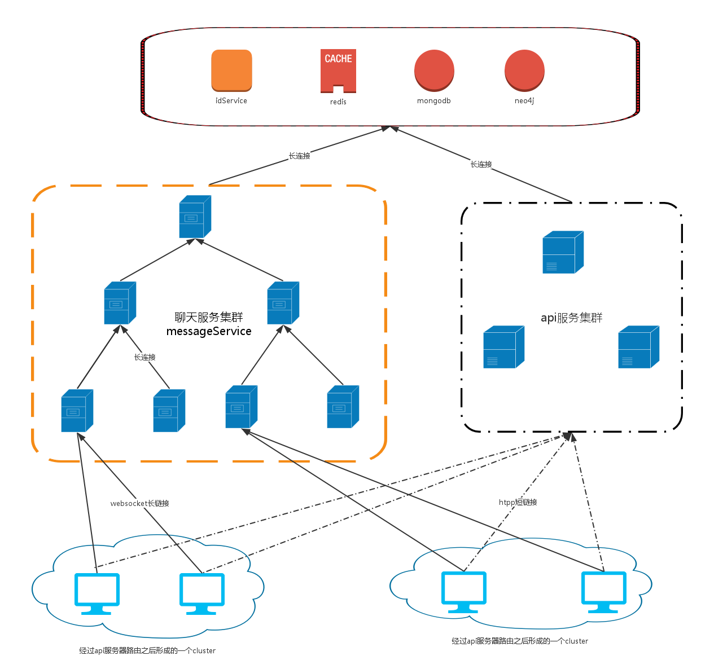

longChat
======
基于websocket的聊天系统  

Features
======
1.扩展伸缩方便，树型架构决定了系统是低耦合的，节点可以随意热拔插  
2.高容错性，聊天集群上每一个节点运行的都是同一份代码、同一种数据结构，一台down了时moniter会选举出子节点顶替  
3.基于社交网络的聚类(Clustering)，将联系频繁的用户划分到同一节点服务器，减少父节点服务器转发压力  

Key Services
======
### messageService
消息的主体，维护着子节点和父节点的keepalive长连接，对于messageService而言子节点是messageService服务器还是用户客户端都是一视同仁的，它只负责转发;同时messageService还会连接到父节点messageService，将自己无法处理的消息发送给父节点处理  

### apiService
负责用户登录注册、获取聊天群信息等基本的restful服务，同时负责获取用户cluster以分配messageService的地址

### idService
负责给其他服务配分全局唯一19位纯数字id，id组成:1-13位为unix timestamp，14-17位为每个idService的自增计数器（步长为总idservice数，这样可以保证生成的id不重复），18-19为id类型Type

### storageService
负责持久化用户数据、聊天消息数据，也负责存取redis缓存

### graphService
根据用户聊天频率、聊天对象建立图，根据聚类算法离线计算出每一个用户所属的群(cluster)

Architecture
======
  

Todo
======
- [ ] 聊天集群监控Moniter，单个聊天节点down掉后选举替代节点,自动负载均衡  
- [ ] 私聊转发服务器和群聊转发服务器分离，单独设立群聊转发服务器  

Dependency
======
longChat-Server采用了redis(cluster)和MongoDB、Neo4j分别做cache和持久化存储，需要安装这三者的驱动  
